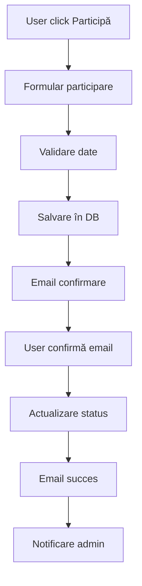

# 🎯 Sistem de Participare la Evenimente - Calarași Warriors

## 📋 Prezentare Generală

Sistemul de participare la evenimente permite utilizatorilor să se înscrie la evenimente viitoare prin intermediul unui formular profesional, cu confirmare prin email și gestionare completă a participanților.

## 🗄️ Structura Bazei de Date

### Tabela `event_participants`

```sql
CREATE TABLE event_participants (
    id SERIAL PRIMARY KEY,
    event_id INTEGER NOT NULL REFERENCES events(id) ON DELETE CASCADE,
    first_name VARCHAR(255) NOT NULL,
    last_name VARCHAR(255) NOT NULL,
    email VARCHAR(255) NOT NULL,
    email_confirmed BOOLEAN DEFAULT FALSE,
    confirmation_token VARCHAR(255),
    expires_at TIMESTAMP,
    confirmed_at TIMESTAMP,
    created_at TIMESTAMP DEFAULT CURRENT_TIMESTAMP,
    updated_at TIMESTAMP DEFAULT CURRENT_TIMESTAMP
);
```

**Indexuri pentru performanță:**
- `event_id` - pentru căutări rapide după eveniment
- `email` - pentru verificări de duplicare
- `email_confirmed` - pentru filtrarea participanților

## 🚀 Funcționalități Implementate

### 1. **Formular de Participare**
- Pagină dedicată cu design profesional
- Validare client-side și server-side
- Responsive design pentru toate dispozitivele
- Integrare cu sistemul de evenimente existent

### 2. **Sistem de Confirmare prin Email**
- Token unic de confirmare (24 ore valabilitate)
- Email profesional cu logo și design modern
- Confirmare automată la click pe link
- Notificări pentru admin și participant

### 3. **Gestionare Participanți**
- Pagină de administrare cu statistici
- Lista completă a participanților
- Status tracking (în așteptare/confirmat)
- Export și raportare

### 4. **Integrare cu Sistemul Existent**
- Compatibil cu tabela `events` existentă
- Folosește același sistem de email (SMTP)
- Respectă arhitectura Astro existentă

## 📁 Structura Fișierelor

```
src/
├── pages/
│   ├── api/
│   │   ├── event-participation.ts          # POST - Înregistrare participare
│   │   └── confirm-event-participation.ts  # GET - Confirmare participare
│   ├── participa-la-eveniment/
│   │   └── [eventId].astro                 # Pagina de participare
│   └── admin/
│       └── event-participants/
│           └── [eventId].astro             # Admin - lista participanți
├── components/
│   └── EventParticipationButton.astro      # Buton reutilizabil
├── lib/
│   └── events.ts                           # Funcții pentru evenimente
└── layouts/
    └── MainLayout.astro                     # Layout-ul principal

migrations/
└── 20250817150000_create_event_participants_table.cjs

scripts/
└── run-event-migrations.js                 # Script pentru migrații
```

## 🔧 Instalare și Configurare

### 1. **Rulare Migrații**

```bash
# Rulare automată la deploy (Vercel)
# Migrațiile se rulează automat în producție

# Rulare manuală local
node scripts/run-event-migrations.js
```

### 2. **Variabile de Mediu Necesare**

```env
# SMTP Configuration
SMTP_HOST=smtp.gmail.com
SMTP_PORT=587
SMTP_USER=your-email@gmail.com
SMTP_PASS=your-app-password

# Site Configuration
SITE_URL=https://credinta.live
EMAIL_TO=admin@credinta.live

# Database
DATABASE_URL=postgresql://...
```

### 3. **Dependințe**

```json
{
  "dependencies": {
    "nodemailer": "^6.9.0",
    "knex": "^2.5.0",
    "pg": "^8.11.0"
  }
}
```

## 🎨 Design și UX

### **Paleta de Culori**
- **Primary**: `#3498db` (Blue)
- **Success**: `#27ae60` (Green)
- **Warning**: `#f39c12` (Yellow)
- **Error**: `#e74c3c` (Red)
- **Neutral**: `#2c3e50` (Dark Blue)

### **Componente UI**
- Butoane cu hover effects
- Formulare cu validare vizuală
- Mesaje de succes/eroare animate
- Loading states pentru acțiuni
- Responsive grid layouts

### **Email Templates**
- Design profesional cu logo
- Responsive pentru mobile
- Call-to-action buttons
- Informații clare și concise

## 🔄 Fluxul de Participare



## 📊 API Endpoints

### **POST /api/event-participation**
Înregistrează o nouă participare la eveniment.

**Request Body:**
```json
{
  "eventId": "1",
  "firstName": "Ion",
  "lastName": "Popescu",
  "email": "ion.popescu@example.com"
}
```

**Response:**
```json
{
  "success": true,
  "message": "Participarea a fost înregistrată cu succes!",
  "participantId": 123
}
```

### **GET /api/confirm-event-participation?token=...**
Confirmă participarea prin token.

**Response:** Pagină HTML cu confirmarea succesului.

## 🛡️ Securitate

### **Validări Implementate**
- Sanitizare input-uri
- Validare email format
- Token unic pentru confirmare
- Expirare automată (24 ore)
- Protecție împotriva duplicatelor

### **Rate Limiting**
- O participare per email per eveniment
- Verificare token expirat
- Logging pentru audit

## 📈 Monitorizare și Analytics

### **Metrici Disponibile**
- Numărul total de participanți
- Participanți confirmați vs. în așteptare
- Rate de conversie (înscrieri → confirmări)
- Timpul mediu până la confirmare

### **Logging**
- Toate acțiunile sunt logate
- Erori cu stack traces complete
- Audit trail pentru participanți

## 🚀 Deployment

### **Vercel**
- Migrațiile se rulează automat
- API routes sunt optimizate
- Static generation pentru pagini

### **Environment Variables**
- Configurare automată pentru producție
- SMTP settings pentru email
- Database connection pooling

## 🔧 Mantenanță

### **Backup și Restore**
- Backup automat al tabelei `event_participants`
- Export participanți în CSV
- Restore point pentru migrații

### **Cleanup**
- Token-uri expirate se șterg automat
- Participanți neconfirmați după 30 zile
- Optimizare indexuri periodică

## 📞 Suport și Debugging

### **Debug Endpoints**
- `/api/debug-migrations` - Status migrații
- Logs detaliate în console
- Health checks pentru database

### **Troubleshooting**
- Verificare SMTP settings
- Database connection issues
- Token validation problems

## 🎯 Roadmap Viitor

### **Funcționalități Planificate**
- [ ] Export participanți în Excel
- [ ] Notificări SMS
- [ ] QR codes pentru check-in
- [ ] Integrare cu calendar
- [ ] Reminder emails automate

### **Îmbunătățiri**
- [ ] Dashboard analytics avansat
- [ ] Multi-language support
- [ ] Mobile app companion
- [ ] Social media integration

---

**Creat de:** Calarași Warriors Development Team  
**Ultima actualizare:** August 2024  
**Versiune:** 1.0.0
