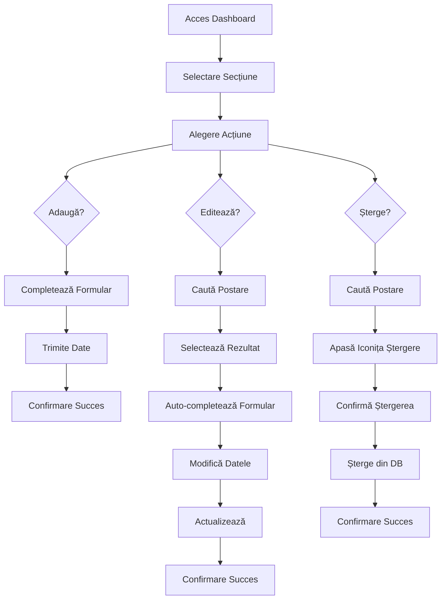

# 📋 Ghid Complet - Sistem Management Postări

## 🎯 Prezentare Generală

Sistemul de management al postărilor permite administratorilor să gestioneze complet postările de proiecte și știri prin interfața web. Sistemul oferă funcționalități complete de **adăugare**, **editare** și **ștergere** cu o interfață intuitivă și optimizată.

## 🚀 Funcționalități Principale

### 1. **Management Unificat**
- **Un singur formular** pentru adăugare și editare
- **Toggle între secțiuni**: Proiecte și Știri
- **Interfață consistentă** pentru toate operațiunile

### 2. **Sistem de Căutare Avansat**
- **Căutare în timp real** după titlu și conținut
- **Rezultate instantanee** cu preview
- **Filtrare automată** după secțiunea activă
- **Minimum 2 caractere** pentru căutare

### 3. **Editare Inteligentă**
- **Auto-completare completă** a formularului
- **Gestionare media**: Video YouTube, imagini Cloudinary, galerie
- **Câmpuri dinamice**: Date simple/multiple, cuvinte cheie
- **Validare completă** a datelor

### 4. **Ștergere Sigură**
- **Confirmare obligatorie** înainte de ștergere
- **Iconiță de ștergere** în rezultatele de căutare
- **Feedback vizual** pentru toate acțiunile

## 🔧 Cum să Utilizezi Sistemul

### **Pasul 1: Accesare Dashboard**
1. Navighează la `/admin/dashboard`
2. Autentifică-te cu credențialele de admin
3. Vei vedea interfața principală cu butoanele de acțiune

### **Pasul 2: Selectare Secțiune**
- **Proiect**: Pentru gestionarea proiectelor
- **Știre**: Pentru gestionarea știrilor
- Sistemul va actualiza automat interfața

### **Pasul 3: Alegere Acțiune**

#### **🟢 Adaugă Postare**
1. Apasă butonul **"Adaugă"**
2. Completează formularul cu toate detaliile
3. Gestionează media (video, imagini, galerie)
4. Apasă **"Adaugă proiect/știre"**

#### **🔵 Editează Postare**
1. Apasă butonul **"Editează"**
2. Caută postarea dorită în bara de căutare
3. Apasă pe rezultatul găsit
4. Formularul se va completa automat
5. Modifică câmpurile dorite
6. Apasă **"Actualizează proiect/știre"**

#### **🔴 Șterge Postare**
1. Apasă butonul **"Șterge"**
2. Caută postarea dorită în bara de căutare
3. Apasă pe iconița de ștergere (🗑️) din dreapta rezultatului
4. Confirmă ștergerea în dialogul care apare

## 📊 Structura Datelor

### **Câmpuri Obligatorii**
- **Titlu**: Titlul postării
- **Conținut**: Textul principal
- **Tip postare**: Eticheta (CONFERINTA, JOC SPORTIV, etc.)
- **Data**: Data creării/evenimentului

### **Câmpuri Opționale**
- **Cuvinte cheie**: Pentru evidențiere și SEO
- **Media**: Video YouTube, imagini Cloudinary
- **Galerie**: Imagini suplimentare
- **URL**: Link extern (doar pentru știri)
- **Formular participare**: Pentru proiecte active

### **Câmpuri Automatice**
- **ID**: Generat automat
- **Data creării**: Timestamp automat
- **Data actualizării**: La modificări
- **Tip proiect**: Calculat automat (trecut/viitor/curent)

## 🔒 Securitate

### **Autentificare**
- **Token JWT** pentru toate operațiunile
- **Verificare rol** admin obligatorie
- **Expirare token** pentru securitate

### **Validare**
- **Validare server-side** pentru toate datele
- **Sanitizare** a input-urilor
- **Verificare existență** înainte de operațiuni

## 🎨 Interfața Utilizator

### **Design Responsive**
- **Mobile-first** approach
- **Adaptare automată** la toate dimensiunile de ecran
- **Interacțiuni touch-friendly**

### **Feedback Vizual**
- **Mesaje de succes/eroare** pentru toate acțiunile
- **Loading states** pentru operațiuni asincrone
- **Confirmări** pentru acțiuni critice

### **Accesibilitate**
- **Navigare cu tastatura** completă
- **Labels descriptive** pentru toate câmpurile
- **Contrast optim** pentru vizibilitate

## 🚨 Gestionarea Erorilor

### **Erori de Căutare**
- Mesaj când nu se găsesc rezultate
- Validare pentru query-uri prea scurte
- Fallback pentru probleme de conexiune

### **Erori de Formular**
- Validare în timp real
- Mesaje specifice pentru fiecare câmp
- Prevenirea trimiterii datelor incomplete

### **Erori de Server**
- Mesaje user-friendly pentru erori tehnice
- Logging complet pentru debugging
- Retry automat pentru operațiuni eșuate

## 📈 Performanță

### **Optimizări Frontend**
- **Debouncing** pentru căutare
- **Lazy loading** pentru rezultate
- **Caching** pentru date frecvent accesate

### **Optimizări Backend**
- **Indexuri** pentru căutări rapide
- **Paginare** pentru rezultate mari
- **Compresie** pentru răspunsuri API

## 🔄 Workflow Complet

## 🎯 Beneficii

### **Pentru Administratori**
- **Eficiență maximă** în gestionarea conținutului
- **Interfață intuitivă** fără necesitatea de cunoștințe tehnice
- **Gestionare centralizată** a tuturor postărilor
- **Feedback imediat** pentru toate acțiunile

### **Pentru Dezvoltatori**
- **Cod modular** și ușor de întreținut
- **API RESTful** complet documentat
- **Validare robustă** a datelor
- **Gestionarea erorilor** comprehensivă

### **Pentru Utilizatori Finali**
- **Conținut actualizat** rapid
- **Experiență consistentă** pe toate paginile
- **Performanță optimă** pentru încărcare
- **Accesibilitate completă**

## 🚀 Următorii Pași

Sistemul este complet funcțional și gata pentru utilizare în producție. Pentru îmbunătățiri viitoare, se pot considera:

1. **Export/Import** de postări
2. **Istoric modificări** pentru fiecare postare
3. **Notificări** pentru modificări importante
4. **Analytics** pentru utilizarea sistemului
5. **Backup automat** al datelor

---

**🎉 Sistemul de management al postărilor este complet implementat și gata pentru utilizare!**
